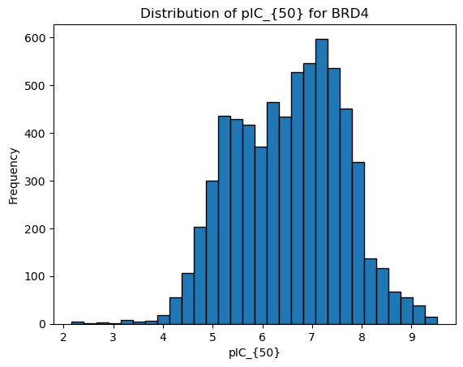
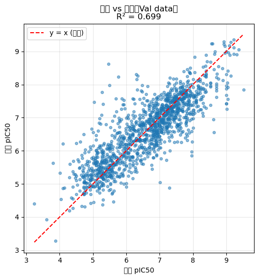
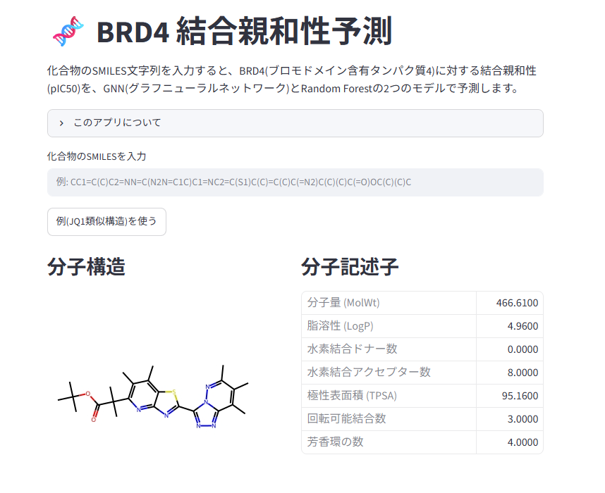
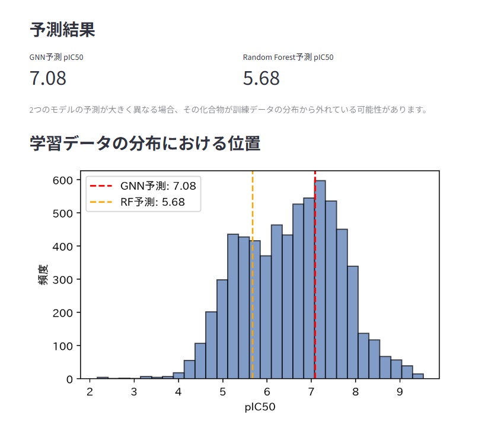

# BRD4 結合親和性予測パイプライン（Compound–Protein Interaction / GNN）

化合物×タンパク質(BRD4)の相互作用データから、グラフニューラルネットワーク(GNN)を用いて結合親和性(pIC50)を予測するパイプライン。バイオインフォマティクス/創薬データサイエンス分野のポートフォリオプロジェクトとして開発。

## 目次

- [背景・目的](#背景目的)
- [パイプライン全体像](#パイプライン全体像)
- [データと前処理](#データと前処理)
- [特徴量設計](#特徴量設計)
- [モデル構造](#モデル構造)
- [学習設定](#学習設定)
- [結果](#結果)
- [アプリのデモ](#アプリのデモ)
- [実行方法](#実行方法)
- [設計判断とその理由](#設計判断とその理由)
- [今後の課題](#今後の課題)
- [技術スタック](#技術スタック)

---

## 背景・目的

BRD4(ブロモドメイン含有タンパク質4)はエピジェネティック制御に関わる創薬標的で、がん領域を中心にBET阻害剤の開発が進んでいる。本プロジェクトは、BRD4に対する化合物の結合親和性(pIC50)を、化合物の分子グラフ構造とタンパク質の構造的特徴の両方から予測するCPI(Compound-Protein Interaction)モデルを、ChEMBLの公開データのみを用いて構築したもの。

構造生物学のバックグラウンドを活かし、独学でバイオインフォマティクス/創薬データサイエンス分野の技術を身につける中で本プロジェクトに取り組んだ。単にモデルの精度を追うのではなく、**データの品質検証・実験設計上の判断・誠実な評価**を重視して進めている。

## パイプライン全体像

```
ChEMBL REST API (活性データ取得)
        │
        ▼
前処理・データクレンジング（IC50実測値の抽出、pIC50変換、SMILES標準化）
        │
        ▼
特徴量抽出
 ├─ 化合物: 原子特徴量・結合特徴量・分子記述子（RDKit）
 └─ タンパク質: BD1ドメインのSASAベクトル（Biopython, PDB 3mxf）
        │
        ▼
GNN (GINEConv) によるCPIモデル学習
        │
        ▼
評価・ベースライン比較（Random Forest + Morganフィンガープリント）
```

## データと前処理

- **データソース**: ChEMBL REST API（`https://www.ebi.ac.uk/chembl/api/data/activity.json`）を直接HTTPページネーションで叩き、BRD4(UniProt: O60885)に対するIC50活性データを取得。当初はchembl_webresource_clientのみで取得していたが、通信の安定性向上のため直接APIコールへ切り替え。タンパク質構造は[RCSB PDB](https://www.rcsb.org/structure/3MXF)（3MXF、パブリックドメイン）から取得。
- **フィルタリング条件**: `standard_type=IC50`, `standard_units=nM`, `pchembl_value`が非null、かつ`standard_relation='='`（不等号による丸め値を除外し、実測値のみを使用）。
- **単位変換**: `standard_value`(nM)を`pIC50 = -log10(value × 1e-9)`に変換。
- **SMILES標準化**: RDKitで塩の除去・電荷の中和などを行い、`standard_smiles`として統一。重複する構造はpIC50の平均値に集約。

### アッセイのカットオフ値アーティファクトの発見と対処

データ品質を確認する過程で、pIC50 ≈ 4.3付近に**構造の異なる多数の化合物が同一のstandard_value**(50500 nM等)に集中している現象を発見した。値を調べると対数希釈系列(10^0.1刻み)と一致しており、実験の最高測定濃度がそのままIC50として記録された、アッセイ由来の人工的な値であると特定した。

- 当初「10件以上重複する値をすべて除外する」という頻度ベースの基準を検討したが、実際には全体の約60%のデータが失われることが判明。小さい整数値（10 nM, 100 nMなど）の重複は「実在する強力な化合物」である可能性が高く、機械的な頻度フィルタでは真のシグナルまで除去してしまう。
- 最終的に、目視で特定した高濃度側のカットオフ候補値（50500, 25118.86, 19952.62, 15848.93, 12589.25, 10000, 5500, 2750, 550 nM）のみを個別に除外する方針を採用。全体の約19%を除外し、最終的に6,677件のデータを使用。
- カットオフ除去後、見かけ上のR²は0.669→0.625へ低下したが、Val Loss(MSE)はほとんど変化していなかった。これは、除去した外れ値クラスターが予測しやすい「疑似シグナル」としてR²を人為的に底上げしていただけであることを意味する。**見かけの精度よりデータの誠実性を優先する**という判断のもとで採用した。

カットオフ値除外後の最終的なpIC50分布は以下の通り(n=6,677)。



## 特徴量設計

### 化合物側（RDKitで抽出）

| 種類 | 内容 | 次元数 |
|---|---|---|
| ノード特徴量（原子） | 原子番号、degree、水素数、形式電荷、芳香族性、混成軌道 | 6 |
| エッジ特徴量（結合） | 結合次数（単結合=1.0, 二重=2.0, 三重=3.0, 芳香族=1.5） | 1 |
| 分子記述子（グローバル） | MolWt, LogP, NumHDonors, NumHAcceptors, TPSA, NumRotatableBonds, NumAromaticRings（標準化済み） | 7 |

### タンパク質側（Biopython + PDB 3mxf）

- BRD4のBD1ドメイン（残基44–168、Aチェーンのみ）をPDB構造3mxfから抽出。
- Shrake-Rupleyアルゴリズムで各残基のSASA(溶媒露出表面積)を計算し、125次元の固定長ベクトルとして使用。
- 単一ターゲット(BRD4)固定のパイプラインであるため、全化合物に対して同一のタンパク質ベクトルを使用している（詳細は下記「設計判断」を参照）。

## モデル構造

`CPIRegressor`（PyTorch Geometric）: 化合物・タンパク質・分子記述子の3系統を独立にエンコードし、結合(concat)して回帰する構成。

1. **化合物エンコーダ**: `GINEConv`を2層（各128次元）。`GCNConv`から`GINEConv`へ変更し、結合種別(edge_type)を畳み込みに反映できるようにした。`global_mean_pool`で分子全体を1つの128次元ベクトルに集約。
2. **タンパク質エンコーダ**: 125次元のSASAベクトルを全結合層で128次元に変換。
3. **分子記述子エンコーダ**: 7次元の記述子を全結合層で128次元に変換。
4. **統合・予測ヘッド**: 上記3つの128次元ベクトルを連結(384次元)→全結合層(128次元)→出力層(1次元、pIC50)。

## 学習設定

- Train/Val分割: 8:2（`random_state=42`で固定）
- 最適化: Adam（学習率0.001）
- 学習率スケジューラ: `ReduceLROnPlateau`（Val Lossが5エポック改善しなければ学習率を半減）
- Early Stopping: patience=15。最良モデル（Val Loss最小時点の重み）を保存・復元。
- 損失関数: MSE

## 結果

| モデル | Val Loss (MSE) | R² |
|---|---|---|
| Random Forest（Morganフィンガープリント, 2048bit） | 0.2891 | 0.7663 |
| GNN（GINEConv + 特徴量拡張 + Early Stopping） | 0.3748 | 0.718 |

GNNはEarly StoppingによりEpoch 127（Val Loss = 0.3748）がベストとなり、142エポックで学習を打ち切った。



**このデータ規模(6,677件)では、古典的なRandom Forest + Morganフィンガープリントのベースラインが、GINEConvベースのGNNをやや上回った。** これはQSAR分野で報告されている既知の傾向（データ規模が数千件程度の場合、深層学習ベースの手法が古典的手法に対して優位性を示しにくい）と一致する結果であり、失敗ではなく妥当な評価結果として両モデルの結果を並記している。モデル選択における「精度が最も高い手法を選ぶ」ではなく「何がなぜ効くのか/効かないのかを理解した上で提示する」という姿勢を重視した。

## アプリのデモ

SMILESを入力すると、GNNとRandom Forestの両方でpIC50を予測し、分子構造・分子記述子・学習データ分布上での位置を確認できるStreamlitアプリを実装した。





## 実行方法

```bash
# 1. 依存パッケージのインストール
pip install -r requirements.txt

# 2. 学習済みモデル・特徴量のアーティファクトを生成
#    （chembl1.ipynbを最後まで実行した後、export_artifacts_cell.pyの内容を
#     ノートブック末尾の新規セルにコピーして実行。app_artifacts/ が生成される）

# 3. アプリを起動
streamlit run app.py
```

## 設計判断とその理由

- **タンパク質をグラフ化せず、固定ベクトルとした理由**: 本プロジェクトは単一ターゲット(BRD4)に対する予測に特化しているため、全化合物で同一のタンパク質表現を用いても学習上の問題は生じない。限られた開発時間の中で、複数ターゲットに一般化するためのタンパク質グラフ化に投資するよりも、化合物側の表現力（エッジ特徴量、分子記述子）の拡充を優先する方が、本プロジェクトの目的（BRD4というターゲットに対する予測精度の追求）に対して費用対効果が高いと判断した。
- **BD1ドメイン残基範囲(44–168)**: 現時点では既存文献等を参考にした決め打ちの範囲。著者が学生時代に構築した構造解析パイプライン（BSA・保存度スコア計算）を用いて、この範囲選定の妥当性を客観的な基準で裏付けることを今後の課題としている（下記参照）。

## 今後の課題

- **カットオフ値検出の自動化**: 現状、アッセイのカットオフ由来の異常値は目視で候補を特定している。今後は、(1)出現頻度の統計的外れ値検出と、(2)想定される希釈系列パターン（等比数列）との一致判定を組み合わせ、属人的な目視確認に頼らない自動検出ロジックへ置き換える予定。
- **BD1残基範囲の妥当性検証**: 学生時代に構築したタンパク質間相互作用解析パイプライン（BSA・保存度スコア計算）を用いて、決め打ちだった残基範囲(44–168)を客観的な基準で選定し直す。これは精度向上ではなく、モデル設計の妥当性を示す位置づけ。

## 技術スタック

- **データ取得**: ChEMBL REST API, requests
- **化学情報処理**: RDKit
- **タンパク質構造解析**: Biopython (PDBParser, Shrake-Rupley SASA)
- **深層学習**: PyTorch, PyTorch Geometric（GINEConv, global_mean_pool）
- **ベースライン・評価**: scikit-learn (RandomForestRegressor, train_test_split, metrics)
- **可視化**: matplotlib
- **アプリ化**: Streamlit
